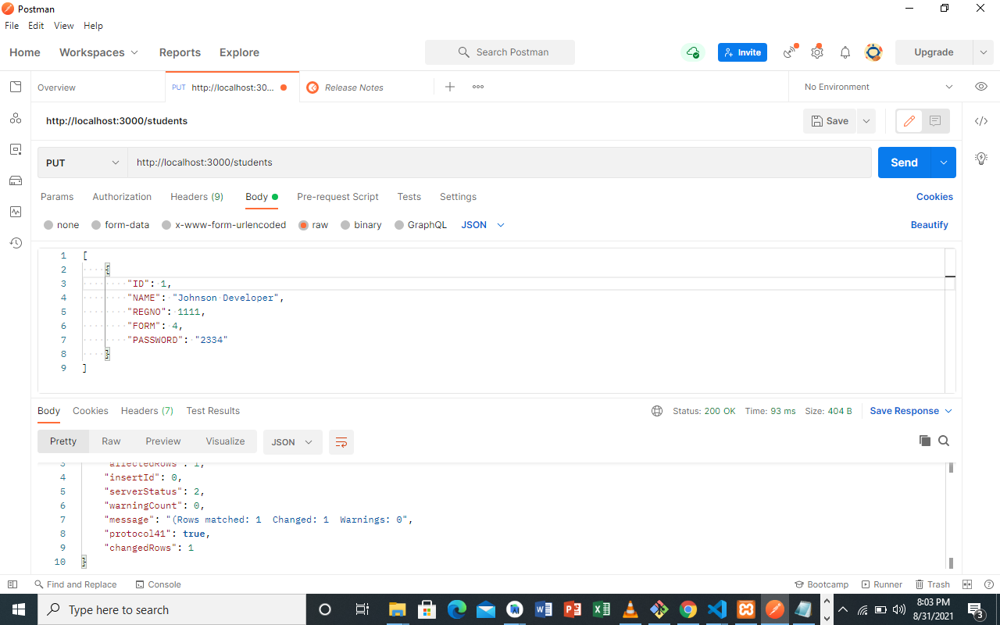

# NodeCrudApi
## An Express js crud api with mysql. It does the following:
<ol>
<li> Insert new Student record</li>
<li> Deletes a Student record</li>
<li> gets a list of all Students</li>
<li> gets a specific student record</li>
<li> Update Student record</li>
</ol>

#### Uses sql queries and json format
#### Sql database contains four tables teachers,students,parents and admin. But to demonstrate the skill i have only used students table.

## Below are some of images of Postman Output on various requets
 ### CREATE STUDENT

 
 

 ###UPDATE SPECIFIC STUDENT REQUEST

 

 
 ### GET ALL STUDENTS REQUEST

 
 
 
 ### GET SPECIFIC STUDENT BY ID REQUEST

 
 

 ### DELETE STUDENT BY ID REQUEST

 
 

